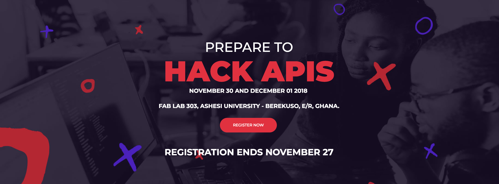
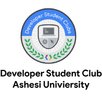
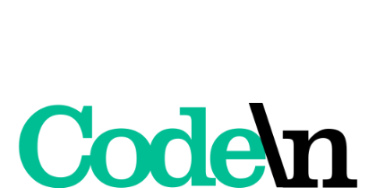

# HackAPIs:Connect Hackathon Guide

## About the Event

**This is a 2-day Hackathon happening at the Ashesi University campus from 30th November 2018 to 1st December 2018. API: Connect would have cash prizes and swags for the winning teams which would be the best 3 projects. The participating teams would have a number of 3 to 4 individuals each. Food and all required logistics would be provided for participants except transportation to the venue.**

Each participant is free to build awesome products on provided APIs and services but must meet certain criteria, including:

* **Solutions must have a real-world use case.**    
* **Participants must utilize at least one of the sponsors API \(i.e. Cloudinary API\). Familiarize themselves with the API but trainers will be on sight to assist them with the integration**    
* **Solutions will be open-sourced on GitHub.**    

## [**Create a Free Cloudinary Account**](https://cloudinary.com/users/register/free)



## **Join the WhatsApp Group!**



## **Event Programme**

### **Friday 30-11**

**14:00 - 15:00**

| **Speeches & Introduction from the hosts and sponsors** | Opening Ceremony |
| :--- | :---: |

**15:00**

| **Team formation, ideation and product building** | Hackathon Begins |
| :--- | :---: |

### **Saturday 1-12**

**14:00**

| Participants should have finalized their final products slides and submitted them on hackathon.io for judging | **Code Freeze** |
| :--- | :--- |

**15:00**

| **Participants will present the ideas they have  worked on and based on the judging the 1st 2nd and 3rd teams will be awarded.** | Presentations & Awards |
| :--- | :---: |

##                                                       Prizes

###                                          _**\*\*  Best Overall Project - GHc 1000 \*\***_

###                                                _**\*\* 1st Runner Up - GHc 600 \*\***_

###                                               _**\*\* 2nd Runner Up - GHc 400 \*\***_

## Partners & Sponsors







  

