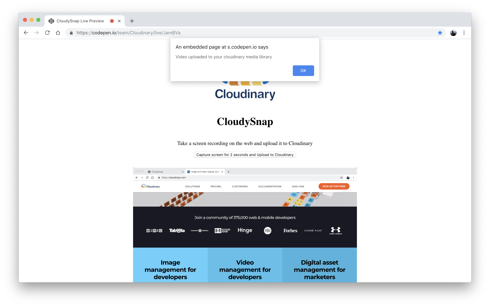

# Connecting With Cloudinary

## Understand the Connection Process

Note this code snippet in the `index.html` file:

```javascript
[...]        
    let opts = { mimeType: 'video/webm; codecs=vp9' };
    let rec = new MediaRecorder(videoElement.srcObject, opts);
    let blobs = [];

    rec.ondataavailable = (e) => (e.data && e.data.size > 0) ? blobs.push(e.data) : null;
    rec.onstop = () => {
        //  get the image blob
        let finalBlob = new Blob(blobs, { type: 'video/mp4' });
        // create form data for submission         
        let formData = new FormData();
        formData.append('upload_preset', 'CLOUDINARY_UPLOAD_PRESET');
        formData.append('api_key', "CLOUDINARY_API_KEY");
        formData.append('file', finalBlob);
        var xhr = new XMLHttpRequest();
        xhr.open("POST", 'https://api.cloudinary.com/v1_1/CLOUDINARY_CLOUD_NAME/auto/upload');
        xhr.onreadystatechange = function () {
            if (this.readyState == XMLHttpRequest.DONE && this.status == 200) {
                console.log(this.status);
                alert("Video uploaded to your cloudinary media library");
            }
        }
        xhr.send(formData);
    }
    rec.start(100);
    setTimeout(() => rec.stop(), 2000)
[...]
```

Lines `2-26` implement the core upload capability by first creating a media recording with `videoElement.srcObject`. Below that are the definitions of the properties for the `rec` variable, which instructs the recorder on how to act in various situations.

The `rec.onstop` property is of particular interest. When a recording is complete, the recorder obtains the recorded data and sends them as a single blob to Cloudinary with Cloudinary's Upload Presets.


To further handle the videos you have uploaded, leverage [Cloudinary](https://cloudinary.com/). First, [create an account](https://cloudinary.com/signup) there.


## **Find Out Your Cloud Name**  <a id="find-out-your-cloud-name"></a>

Cloudinary then takes you to your **Dashboard** \(media console\), in which your cloud name is displayed under **Account Details** \(see the screenshot below\). Replace the `CLOUDINARY_CLOUD_NAME` and `CLOUDINARY_API_KEY` variable in the `index.html` file in the previous code segments with that name.


## **Create a Cloudinary Upload Preset**  <a id="create-a-cloudinary-upload-preset"></a>

Cloudinary Upload Presets enable you to set up the default behavior of your image uploads. That means that, instead of having to add parameters to apply to your images every time you upload one, you can define tags, transformations, and other analysis presets from your Cloudinary console. Simply specify the preset name in your code and you’re good to go!

To create a preset, go to the [Upload Settings](https://cloudinary.com/console/settings/upload) screen and click the **Add upload preset** link:


The **Add upload preset** screen is then displayed:


Type a name of your choice under **Preset name**, set **Mode** to **Unsigned**, and then specify the other details, as appropriate.

Now go back to the `index.html` file and replace `CLOUDINARY_UPLOAD_PRESET` with the name of your preset.

\*\*\*\*

## Test Uploads to Cloudinary

Now that you've added all your Cloudinary details to the `index.html` file, go to your Chrome browser and run your demo app. Afterwards, you'll see this display:



