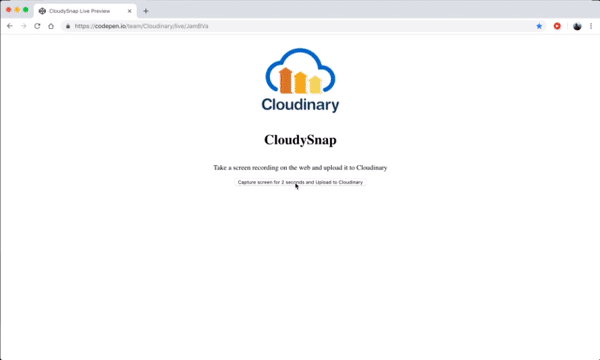

# Adding the Pertinent Features

To add features to the screen recorder, put the following script in your `index.html` file:

```javascript
[...]

<script>
    let recorder = document.getElementById('recorder')

    let videoElement = document.getElementById('videoElement')

    recorder.onclick = async () => {
        let mStream = await navigator.getDisplayMedia({ 'video': true })

        videoElement.srcObject = mStream

        let opts = { mimeType: 'video/webm; codecs=vp9' };
        let rec = new MediaRecorder(videoElement.srcObject, opts);
        let blobs = [];

        rec.ondataavailable = (e) => (e.data && e.data.size > 0) ? blobs.push(e.data) : null;
        rec.onstop = () => {
            //  get the image blob
            let finalBlob = new Blob(blobs, { type: 'video/mp4' });
            // create form data for submission         
            let formData = new FormData();
            formData.append('upload_preset', 'CLOUDINARY_UPLOAD_PRESET');
            formData.append('api_key', "CLOUDINARY_API_KEY");
            formData.append('file', finalBlob);
            var xhr = new XMLHttpRequest();
            xhr.open("POST", 'https://api.cloudinary.com/v1_1/CLOUDINARY_CLOUD_NAME/auto/upload');

            xhr.onreadystatechange = function () {
                if (this.readyState == XMLHttpRequest.DONE && this.status == 200) {
                    console.log(this.status);
                    alert("Video uploaded to your cloudinary media library");
                }
            }

            xhr.send(formData);
        }

        rec.start(100);
        setTimeout(() => rec.stop(), 2000)
    };
</script>

[...]
```


Be sure to replace the variables`CLOUDINARY_UPLOAD_PRESET`, `CLOUDINARY_API_KEY`, and`CLOUDINARY_CLOUD_NAME` with their values for your Cloudinary account. To learn how to obtain those values, see the next section.


Note the following in the script:

* With lines 4 and 6, you obtain the button and video elements you created previously in the interface.  
* Line 8 assigns a function to be executed when you click the recorder button. This function accesses the user's display and then assigns the stream from there to the `srcObject` property of the `videoElement` with this code snippet:

```javascript
let mStream = await navigator.getDisplayMedia({ 'video': true })

videoElement.srcObject = mStream
```

What is being recorded on your screen then becomes visible. When you run the demo app, you'll see the display, as in this example:



The next section details how to connect a recording with Cloudinary. Afterwards, you can store recordings in the Cloudinary Media Library, gaining access to a wide array of capabilities for manipulating videos.

