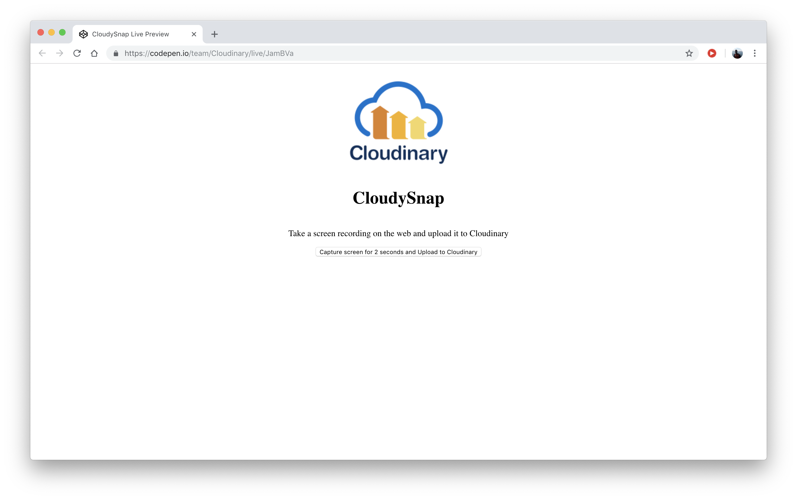

# Building the Interface

To create a screen recorder for the web, you need only to code in regular HTML and JavaScript. As a start, follow the steps below to build the interface.

1. Create a folder called `cloudy-snap`. Type:

```bash
mkdir cloudy-snap
cd cloudy-snap
```

1. Create an `index.html` file in`cloudy-snap` to house the code in the demo app. Type:

```bash
touch index.html
```

1. Edit the `index.html` file to read like this:

```markup
<!DOCTYPE html>
<html lang="en">
<head>
    <meta charset="UTF-8">
    <meta name="viewport" content="width=device-width, initial-scale=1.0">
    <meta http-equiv="X-UA-Compatible" content="ie=edge">
    <title>Cloudy Snap</title>
    <style>
        body{
          display: flex;
          flex-direction: column;
          align-items: center;
        }
        .container{
          display: flex;
          flex-direction: column;
          align-items: center;
        }

        #videoElement{
          width: 50%;
          padding: 30px;
        }
    </style>
</head>
<body>
    
    <h1>CloudySnap</h1>
    <p>Take a screen recording on the web and upload it to Cloudinary</p>
    <div class="container">
      <video id="videoElement" autoplay></video>
      <button id="recorder">
        Capture screen for 2 seconds and Upload to Cloudinary
      </button>
    </div>
</body>
</html>
```

1. Run the`index.html` file in Chrome.

Chrome then displays the interface for the demo app.



At this point, interacting with the interface results in no response from the recorder. The next section shows you how to add capabilities to the recorder and make it work.

