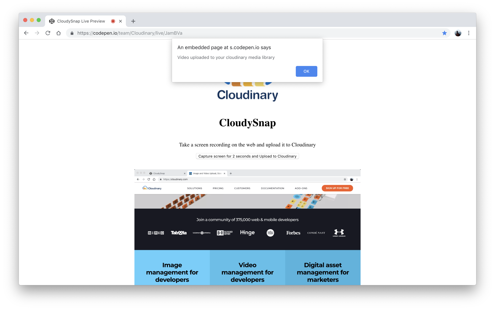
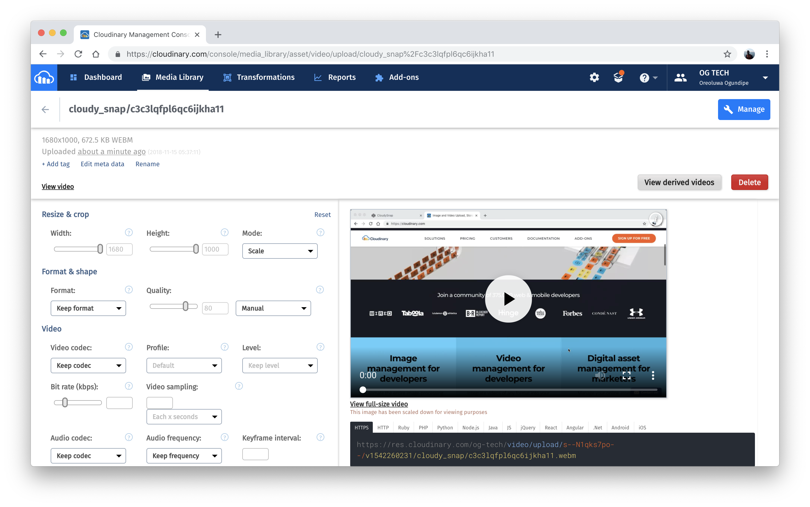

# CloudySnap - Introduction

Have you ever wondered how Google Hangouts and other robust video-call web apps can not only access your screen, but also enable screen sharing during calls? Wonder no more. Just read on.

This tutorial delves into how it all works and shows you how to integrate a screen recorder into a web app. The best part is that you can also send video feeds directly to Cloudinary's image and video platform for easy access and on-the-fly retrieval with Cloudinary APIs.

At the end of this tutorial, you'll have built a demo app that looks like this:

> **Note**: This is where the demo GIFs reside.

