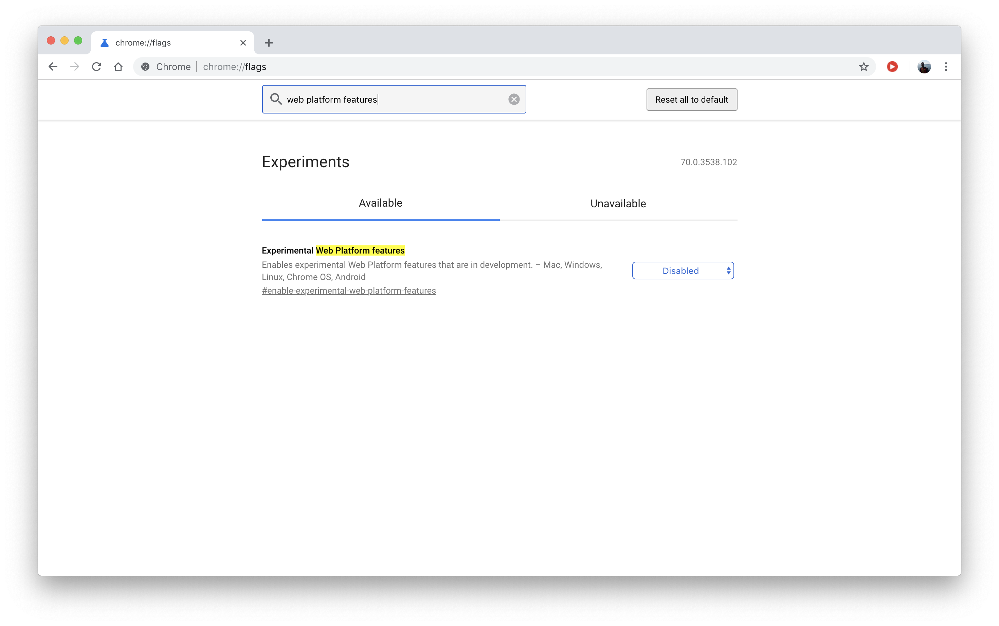
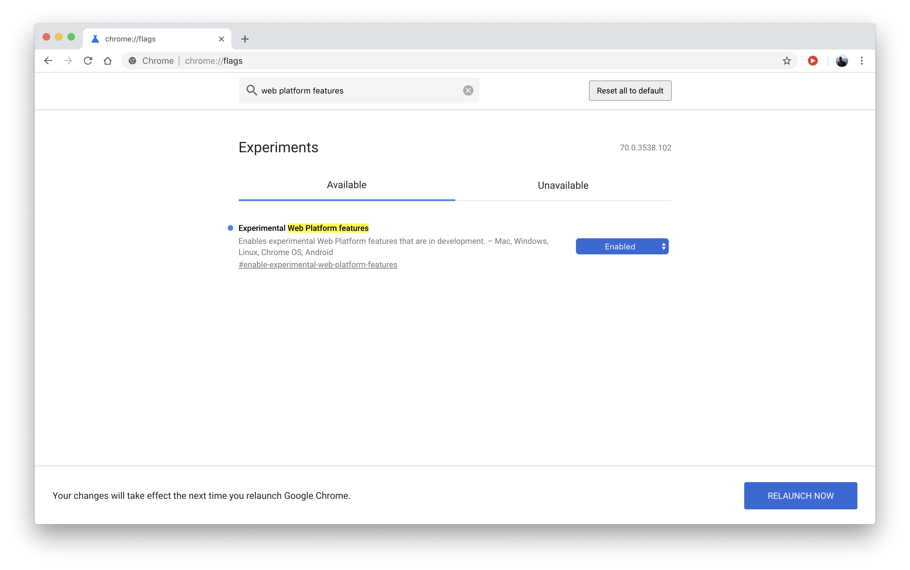

# Putting in Place the Prerequisites

Currently, some of the code in this tutorial requires a few experimental features that will be integrated into the Chrome browser soon. To turn on those features, do the following:

1. On Chrome, go to `chrome://flags` for your current Chrome flags.
2. Type `Experimental Web Platform features` in the search field at the top and press **Enter**.

Chrome displays the **Experiments** page with the section **Experimental Web Platform features** under **Available**.

* Click the downward arrow in the **Disabled** button to choose **Enabled** and then click **RELAUNCH NOW**.

